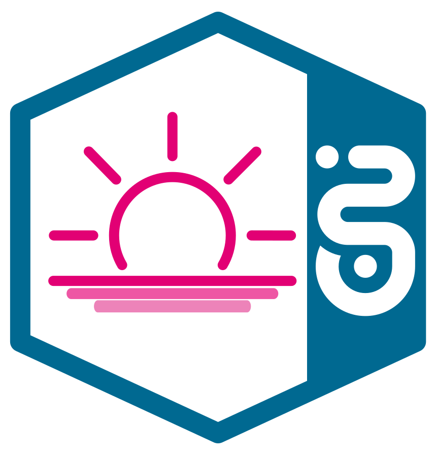

<!--
Copyright 2024 Deutsche Telekom IT GmbH

SPDX-License-Identifier: Apache-2.0
-->

<p align="center">
  
  <h1 align="center">Polaris</h1>
</p>

<p align="center">
  Horizon component for handling circuit breaker and republishing functionality.
</p>

<p align="center">
  <a href="#prerequisites">Prerequisites</a> •
  <a href="#building-polaris">Building Polaris</a> •
  <a href="#configuration">Configuration</a> •
  <a href="#running-polaris">Running Polaris</a>
</p>

<!--
[](https://api.reuse.software/info/github.com/telekom/pubsub-horizon-polaris)
-->
[](https://github.com/telekom/pubsub-horizon-polaris/actions/workflows/gradle-build.yml)

## Overview

Horizon Polaris serves as the circuit breaker within the [Horizon ecosystem](https://github.com/telekom/pubsub-horizon). It ensures the redelivery of failed events by periodically checking the availability of a customer's endpoint using HEAD or GET requests. When the endpoint becomes available again, all events for that customer and endpoint with the status `WAITING` are getting republished and can be picked up by Comet or Pulsar redelivery.

> **Note:** Polaris is an essential part of the Horizon ecosystem. Please refer to [documentation of the entire system](https://github.com/telekom/pubsub-horizon) to get the full picture.

## Prerequisites
For the optimal setup, ensure you have:

- A running instance of Kafka
- Access to a Kubernetes cluster on which the `Subscription` (subscriber.horizon.telekom.de) custom resource definition has been registered

## Building Polaris

### Gradle build

```bash
./gradlew build
```

### Docker build

The default docker base image is `azul/zulu-openjdk-alpine:21-jre`. This is customizable via the docker build arg `DOCKER_BASE_IMAGE`.
Please note that the default helm values configure the kafka compression type `snappy` which requires gcompat to be installed in the resulting image.
So either provide a base image with gcompat installed or change/disable the compression type in the helm values.

```bash
docker build -t horizon-polaris:latest --build-arg="DOCKER_BASE_IMAGE=<myjvmbaseimage:1.0.0>" . 
```

#### Multi-stage Docker build

To simplify things, we have also added a mult-stage Dockerfile to the respository, which also handles the Java build of the application in a build container. The resulting image already contains "gcompat", which is necessary for Kafka compression.

```bash
docker build -t horizon-polaris:latest . -f Dockerfile.multi-stage 
```

## Configuration
Polaris configuration is managed through environment variables. Check the [complete list](docs/environment-variables.md) of supported environment variables for setup instructions.

## Running Polaris
### Locally
Before you can run Polaris locally you must have a running instance of Kafka  locally or forwarded from a remote cluster.
Additionally, you need to have a Kubernetes config at `${user.home}/.kube/config.main` that points to the cluster you want to use.

After that you can run Polaris in a dev mode using this command:
```shell
./gradlew bootRun
```

To start a kafka instance locally you can run the Docker compose file living in the root of this repository:

```bash
docker-compuse up -d
```

## Operational Information

Polaris shares a Hazelcast cache with Comet for writing and reading circuit breaker information. When Comet is unable to deliver an event, Polaris adds an entry to this cache. Polaris periodically polls this cache, picking up entries with the circuit breaker status `OPEN`. It fetches the callback URL from that entry, creates a hash from it and uses that hash to calculate a pod index for workload assignment. If a circuit breaker message is already assigned to another pod, Polaris checks if the pod is still alive. If it is, Polaris skips handling the circuit breaker for the respective callback endpoint.

### Local Integration Test with Tracing

Horizon Polaris includes integration tests that run against an embedded Kafka. To enable local tracing, follow these steps:

1. Spin up Jaeger within Docker using `docker-compose-tracing.yaml`
2. Set `spring.zipkin.enabled` to `true` in the `dynamicProperties()` method of `AbstractIntegrationTest.java`

## Documentation

Read more about the software architecture and the general process flow of Horizon Polaris in [docs/architecture.md](docs/architecture.md).

## Contributing

We're committed to open source, so we welcome and encourage everyone to join its developer community and contribute, whether it's through code or feedback.  
By participating in this project, you agree to abide by its [Code of Conduct](./CODE_OF_CONDUCT.md) at all times.

## Code of Conduct

This project has adopted the [Contributor Covenant](https://www.contributor-covenant.org/) in version 2.1 as our code of conduct. Please see the details in our [CODE_OF_CONDUCT.md](CODE_OF_CONDUCT.md). All contributors must abide by the code of conduct.

By participating in this project, you agree to abide by its [Code of Conduct](./CODE_OF_CONDUCT.md) at all times.

## Licensing

This project follows the [REUSE standard for software licensing](https://reuse.software/).
Each file contains copyright and license information, and license texts can be found in the [./LICENSES](./LICENSES) folder. For more information visit https://reuse.software/.

### REUSE

For a comprehensive guide on how to use REUSE for licensing in this repository, visit https://telekom.github.io/reuse-template/.   
A brief summary follows below:

The [reuse tool](https://github.com/fsfe/reuse-tool) can be used to verify and establish compliance when new files are added.

For more information on the reuse tool visit https://github.com/fsfe/reuse-tool.
